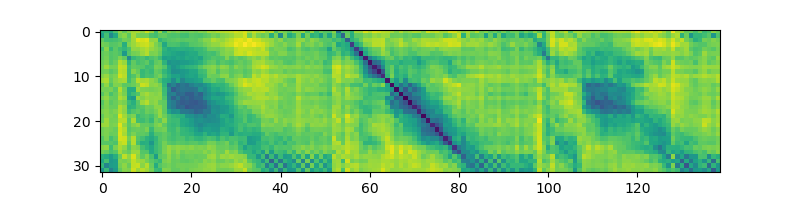
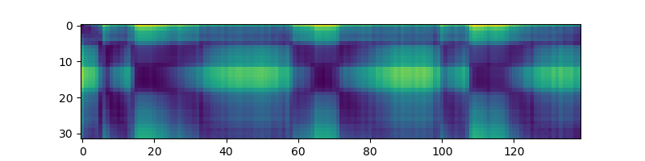
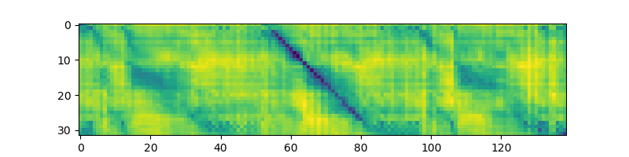
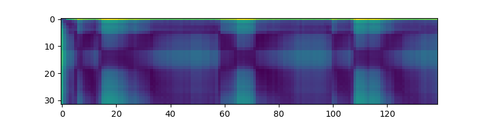
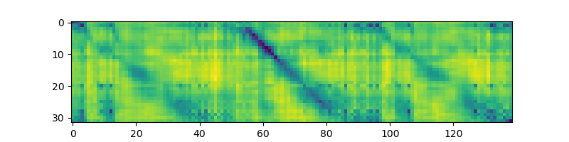
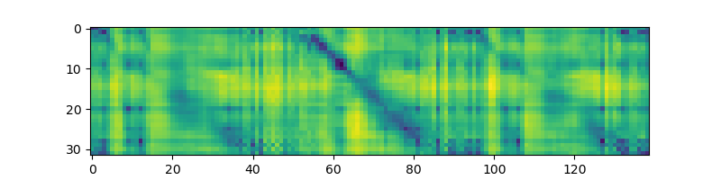
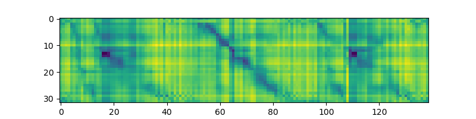
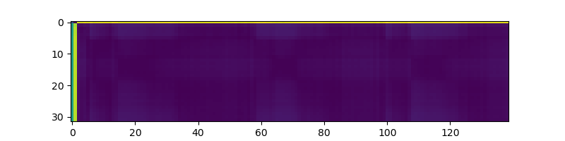
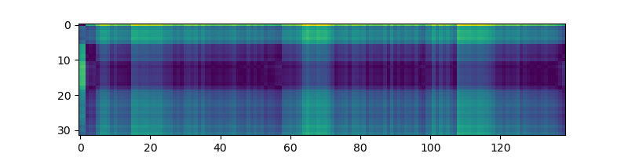

XLSR pilot
================
Nay San
25 March, 2021

## Setup

### R environment

``` r
if (!"pacman" %in% installed.packages()) install.packages("pacman")

pacman::p_load(
  # Use here() to make paths relative from directory containing
  # 'qbe-std_feats_eval.Rproj' (i.e. project root)
  ggplot2,
  ggthemes,
  here,
  knitr,
  purrr,
  dplyr,
  readr,
  stringr,
  tidyr
)

source(here("analyses/plot_mtwvs.R"))
```

## Pilot and main experiment MTWVs

``` r
pilot_mtwv_df <- read_csv(
  file = here("analyses/data/xlsr-all_mtwv.csv"),
  col_types = "ccdddd"
)

main_mtwv_df <- read_csv(
  file = here("analyses/data/main-all_mtwv.csv"),
  col_types = "ccdddd"
)
```

``` r
plot_mtwvs(pilot_mtwv_df, wav2vec_checkpoint_name = "wav2vec 2.0 (XLSR-53)")
```

<!-- -->

``` r
plot_mtwvs(main_mtwv_df)
```

<!-- -->

As can be seen by the MTWV plots, the monolingual model trained on
LibriSpeech outperformed the multilingual model trained on 53 languages
of all our datasets.

## Comparing outputs of monolingual and multilingual models

For QbE-STD, comparing the feature matrix of the query against the
feature matrix of the reference should, ideally, yield a quasi-diagonal
band indicating a high degree of spectral and temporal correlation
between the query and a sub-part of the reference where the query
occurs. Shown below are distance matrices between the feature matrix for
a query ‘hello’ (`analyses/data/hello.wav`) and ‘goodbye hello goodbye’
(`analyses/data/goodbye-hello-goodbye.wav`), computed using outputs from
various layers of the monolingual model as well as the multilingual
model on idealised data (spoken by Nay San, recorded using in Praat the
same microphone/recording environment, etc.). The Python script used to
generate these figures is
`analyses/scripts/generate_w2v2-distance_plots.py`.

### Layer 1

#### Monolingual model



#### Multilingual model



### Layer 5

#### Monolingual model



#### Multilingual model



### Layer 10

#### Monolingual model



#### Multilingual model


### Layer 15

#### Monolingual model



#### Multilingual model


### Layer 20

#### Monolingual model



#### Multilingual model



### Layer 24 (top layer)

#### Monolingual model


#### Multilingual model


